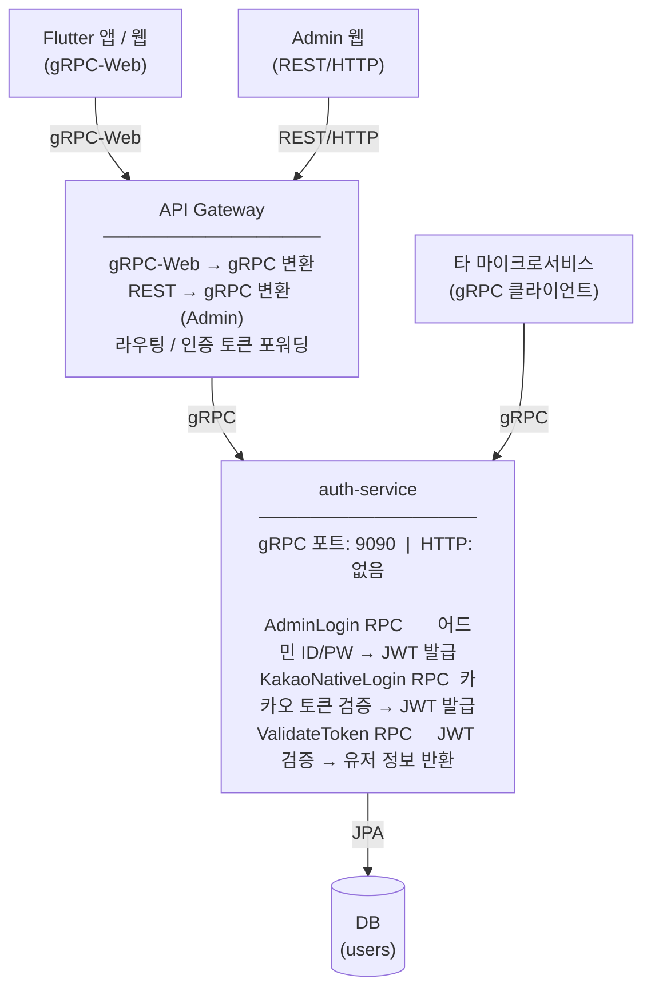

# gRPC 기반 MSA 인증 서비스 구축 가이드

> 기존 seniorvibe-server의 로그인/인증 로직을 그대로 가져와 **독립적인 gRPC 마이크로서비스**로 분리하는 가이드입니다.
> auth-service는 REST 엔드포인트를 일절 노출하지 않으며, 모든 통신은 gRPC(포트 9090)로만 이루어집니다.
> - Flutter 앱/웹 → gRPC-Web → API Gateway → gRPC → auth-service
> - Admin 웹 → REST → API Gateway → gRPC → auth-service
> - 타 마이크로서비스 → gRPC → auth-service (토큰 검증)

---

## 목차

1. [전체 MSA 구조 개요](#1-전체-msa-구조-개요)
2. [프로젝트 셋업](#2-프로젝트-셋업)
3. [Proto 파일 정의](#3-proto-파일-정의)
4. [내부 구조 및 파일 목록](#4-내부-구조-및-파일-목록)
5. [gRPC 서비스 구현](#5-grpc-서비스-구현)
6. [JWT 토큰 로직](#6-jwt-토큰-로직)
7. [어드민 로그인 내부 로직](#7-어드민-로그인-내부-로직)
8. [카카오 OAuth2 네이티브 앱 내부 로직](#8-카카오-oauth2-네이티브-앱-내부-로직)
9. [토큰 검증 흐름 (타 서비스 연동)](#9-토큰-검증-흐름-타-서비스-연동)
10. [유저 엔티티 및 권한](#10-유저-엔티티-및-권한)
11. [환경 설정](#11-환경-설정)

---

## 1. 전체 MSA 구조 개요



> 세션 방식: STATELESS (서버 세션 없음, JWT만 사용)

### 클라이언트별 통신 경로

| 클라이언트 | 프로토콜 | 경로 |
|-----------|---------|------|
| Flutter 앱 (모바일) | gRPC-Web | 앱 → API Gateway → auth-service |
| Flutter 웹 | gRPC-Web | 웹 → API Gateway → auth-service |
| Admin 웹 | REST/HTTP | 웹 → API Gateway(REST→gRPC 변환) → auth-service |
| 타 마이크로서비스 | gRPC | 서비스 → auth-service 직접 |

> **auth-service 자체에는 REST 레이어가 없습니다.** Spring MVC, `@RestController`, HTTP 필터체인 모두 없는 형태를 지향

---

## 2. 프로젝트 셋업

### build.gradle

```gradle
plugins {
    id 'java'
    id 'org.springframework.boot' version '3.x.x'
    id 'com.google.protobuf' version '0.9.4'
}

dependencies {
    // gRPC + Protobuf
    implementation 'net.devh:grpc-server-spring-boot-starter:3.x.x'
    implementation 'io.grpc:grpc-protobuf:1.x.x'
    implementation 'io.grpc:grpc-stub:1.x.x'
    implementation 'com.google.protobuf:protobuf-java:3.x.x'

    //기초 의존성
    implementation 'org.springframework.boot:spring-boot-starter-data-jpa'
    implementation 'org.springframework.boot:spring-boot-starter-security'
    implementation 'io.jsonwebtoken:jjwt-api:0.11.x'
    runtimeOnly   'io.jsonwebtoken:jjwt-impl:0.11.x'
    runtimeOnly   'io.jsonwebtoken:jjwt-jackson:0.11.x'
    implementation 'org.springframework.cloud:spring-cloud-starter-openfeign'
    implementation 'org.springframework.boot:spring-boot-starter-validation'
    runtimeOnly   'com.mysql:mysql-connector-j'
}

protobuf {
    protoc { artifact = 'com.google.protobuf:protoc:3.x.x' }
    plugins {
        grpc { artifact = 'io.grpc:protoc-gen-grpc-java:1.x.x' }
    }
    generateProtoTasks {
        all()*.plugins { grpc {} }
    }
}

sourceSets {
    main {
        proto { srcDirs 'src/main/proto' }
    }
}
```

### application.yml (gRPC 서버 설정 추가)

```yaml
grpc:
  server:
    port: 9090

spring:
  datasource:
    url: jdbc:mysql://...
  jpa:
    hibernate:
      ddl-auto: validate

jwt:
  secret-key: ${JWT_SECRET_KEY}
  access-token-expiration: 12000   # 분
  refresh-token-expiration: 20160  # 분

kakao:
  api:
    user-info-url: https://kapi.kakao.com/v2/user/me
```

---

## 3. Proto 파일 정의

**파일**: `src/main/proto/auth_service.proto`

```protobuf
syntax = "proto3";

package auth;

option java_package = "com.yourcompany.auth.grpc";
option java_outer_classname = "AuthServiceProto";
option java_multiple_files = true;

service AuthService {
  // 어드민 로그인 (ID/PW)
  rpc AdminLogin(AdminLoginRequest) returns (LoginResponse);

  // 카카오 OAuth2 네이티브 앱 로그인
  rpc KakaoNativeLogin(KakaoNativeLoginRequest) returns (KakaoLoginResponse);

  // JWT 토큰 검증 (타 서비스가 호출)
  rpc ValidateToken(ValidateTokenRequest) returns (ValidateTokenResponse);
}

// ── 어드민 로그인 ──────────────────────────────────

message AdminLoginRequest {
  string user_name = 1;
  string password  = 2;
}

message LoginResponse {
  int64  id            = 1;
  string username      = 2;
  string name          = 3;
  string access_token  = 4;
  string refresh_token = 5;
  string role          = 6;
}

// ── 카카오 네이티브 로그인 ─────────────────────────

message KakaoNativeLoginRequest {
  string provider      = 1;   // "kakao"
  string access_token  = 2;   // 카카오 SDK 토큰
  KakaoUserInfo user_info = 3; // 선택
}

message KakaoUserInfo {
  string id           = 1;
  string email        = 2;
  string name         = 3;
  string phone_number = 4;
  string gender       = 5;
  string birth_date   = 6;
}

message KakaoLoginResponse {
  string access_token  = 1;
  string refresh_token = 2;
  KakaoLoginUserInfo user_info = 3;
  bool   is_new_user   = 4;
}

message KakaoLoginUserInfo {
  int64  id          = 1;
  string email       = 2;
  string name        = 3;
  string gender      = 4;
  string birth_date  = 5;
  string social_type = 6;
  string role        = 7;
}

// ── 토큰 검증 ──────────────────────────────────────

message ValidateTokenRequest {
  string token = 1;
}

message ValidateTokenResponse {
  bool   valid    = 1;
  string user_id  = 2;   // JWT subject (socialId 또는 username)
  string role     = 3;
  string reason   = 4;   // 실패 시 사유
}
```

---

## 4. 내부 구조 및 파일 목록

기존 seniorvibe-server 내부 로직을 그대로 가져오되, **Controller 레이어를 gRPC Service로 교체**합니다.

### gRPC 레이어 (신규)

| 파일 | 역할 |
|------|------|
| `grpc/AuthGrpcService.java` | `AuthServiceGrpc.AuthServiceImplBase` 구현체 — 각 RPC를 내부 서비스로 위임 |

### 보안 / JWT (기존 그대로)

| 파일 | 역할 |
|------|------|
| `common/config/SecurityConfig.java` | BCryptPasswordEncoder 빈 (HTTP 필터체인 최소화) |
| `common/security/AuthenticatedUser.java` | Spring Security `User` 래퍼 |
| `domains/user/CustomUserDetailsService.java` | `loadUserByUsername()` |
| `utils/JwtService.java` | JWT accessToken / refreshToken 생성·검증 |

### 어드민 로그인 (기존 그대로, Controller 제거)

| 파일 | 역할 |
|------|------|
| `domains/user/service/UserAdminService.java` | `logInWithRole()` — BCrypt 검증, 역할 확인, JWT 발급 |
| `domains/user/dto/UserAdminDto.java` | `PostLoginReq`, `PostLoginRes` |
| `common/config/InitialDataLoader_Extended.java` | dev/local/test 환경 기본 어드민 계정 생성 |

### 카카오 OAuth2 네이티브 앱 (기존 그대로, Controller 제거)

| 파일 | 역할 |
|------|------|
| `domains/oauth/service/NativeOAuth2Service.java` | 토큰 검증, 유저 로드/생성, JWT 발급 |
| `domains/oauth/service/KakaoApiService.java` | 카카오 API 호출로 토큰 유효성 검증 및 유저 정보 조회 |
| `domains/oauth/dto/NativeOAuth2LoginRequest.java` | `provider`, `accessToken`, `userInfo(선택)` |
| `domains/oauth/dto/NativeOAuth2LoginResponse.java` | `accessToken`, `refreshToken`, `userInfo`, `isNewUser` |

### OAuth2 유저 정보 파싱 (기존 그대로)

| 파일 | 역할 |
|------|------|
| `domains/oauth/OAuth2UserInfo.java` | 유저 정보 추출 인터페이스 |
| `domains/oauth/NativeKakaoOAuth2UserInfo.java` | 네이티브 앱 카카오 응답 파싱 |
| `domains/oauth/OAuth2UserInfoFactory.java` | provider 이름으로 구현체 선택 |
| `domains/oauth/OAuth2Provider.java` | Enum: `KAKAO` |
| `domains/oauth/OAuth2UserPrincipal.java` | `OAuth2User` + `UserDetails` 통합 principal |

### 카카오 API 클라이언트 — Feign (기존 그대로)

| 파일 | 역할 |
|------|------|
| `common/oauth2/KakaoUserInfoApiClient.java` | `kapi.kakao.com/v2/user/me` |
| `common/oauth2/response/KakaoUserInfoResponse.java` | 카카오 유저 정보 응답 DTO |
| `common/oauth2/error/KakaoFeignErrorDecoder.java` | 카카오 API 에러 처리 |
| `common/config/KakaoFeignConfig.java` | Feign 클라이언트 설정 |

### 유저 엔티티 및 저장소 (기존 그대로)

| 파일 | 역할 |
|------|------|
| `domains/user/entity/User.java` | `username`, `password`, `socialId`, `socialType`, `role`, `isOAuth` |
| `domains/user/entity/Role.java` | Enum: `ROLE_NORMAL`, `ROLE_ADMIN`, `ROLE_OPERATE_MANAGER` |
| `domains/user/UserRepository.java` | socialId, username, email, pin, phone 등으로 유저 조회 |

### 예외 (기존 그대로)

| 파일 | 역할 |
|------|------|
| `domains/oauth/exception/InvalidAccessTokenException.java` | 유효하지 않은 accessToken |
| `domains/oauth/exception/OAuth2ApiCallException.java` | 카카오 API 호출 실패 |
| `domains/oauth/exception/UnsupportedProviderException.java` | 지원하지 않는 provider |
| `domains/oauth/exception/UserInfoMismatchException.java` | 클라이언트 유저 정보 불일치 |

---

## 5. gRPC 서비스 구현

**파일**: `grpc/AuthGrpcService.java`

기존 Controller 역할을 대체합니다. 내부 서비스 로직은 그대로 위임합니다.

```java
@GrpcService
public class AuthGrpcService extends AuthServiceGrpc.AuthServiceImplBase {

    private final UserAdminService userAdminService;
    private final NativeOAuth2Service nativeOAuth2Service;
    private final JwtService jwtService;

    // ── 어드민 로그인 ───────────────────────────────────────────

    @Override
    public void adminLogin(AdminLoginRequest req, StreamObserver<LoginResponse> observer) {
        try {
            PostLoginRes res = userAdminService.logInWithRole(
                new PostLoginReq(req.getUserName(), req.getPassword()),
                Role.ROLE_ADMIN, Role.ROLE_OPERATE_MANAGER
            );
            observer.onNext(LoginResponse.newBuilder()
                .setId(res.id())
                .setUsername(res.username())
                .setName(res.name())
                .setAccessToken(res.accessToken())
                .setRefreshToken(res.refreshToken())
                .setRole(res.role())
                .build());
            observer.onCompleted();
        } catch (BaseException e) {
            observer.onError(Status.UNAUTHENTICATED
                .withDescription(e.getStatus().getMessage())
                .asRuntimeException());
        }
    }

    // ── 카카오 네이티브 로그인 ──────────────────────────────────

    @Override
    public void kakaoNativeLogin(KakaoNativeLoginRequest req, StreamObserver<KakaoLoginResponse> observer) {
        try {
            NativeOAuth2LoginRequest loginReq = toServiceRequest(req);
            NativeOAuth2LoginResponse res = nativeOAuth2Service.processNativeLogin(loginReq);

            observer.onNext(KakaoLoginResponse.newBuilder()
                .setAccessToken(res.accessToken())
                .setRefreshToken(res.refreshToken())
                .setIsNewUser(res.isNewUser())
                .setUserInfo(toProtoUserInfo(res.userInfo()))
                .build());
            observer.onCompleted();
        } catch (InvalidAccessTokenException e) {
            observer.onError(Status.UNAUTHENTICATED
                .withDescription("Invalid kakao access token")
                .asRuntimeException());
        } catch (UnsupportedProviderException e) {
            observer.onError(Status.INVALID_ARGUMENT
                .withDescription("Unsupported provider: " + req.getProvider())
                .asRuntimeException());
        }
    }

    // ── 토큰 검증 ───────────────────────────────────────────────

    @Override
    public void validateToken(ValidateTokenRequest req, StreamObserver<ValidateTokenResponse> observer) {
        try {
            jwtService.validate(req.getToken());
            String userId = jwtService.loadUsernameByToken(req.getToken());
            UserDetails userDetails = userDetailsService.loadUserByUsername(userId);
            String role = userDetails.getAuthorities().stream()
                .map(GrantedAuthority::getAuthority)
                .findFirst().orElse("");

            observer.onNext(ValidateTokenResponse.newBuilder()
                .setValid(true)
                .setUserId(userId)
                .setRole(role)
                .build());
            observer.onCompleted();
        } catch (ExpiredJwtException e) {
            observer.onNext(ValidateTokenResponse.newBuilder()
                .setValid(false)
                .setReason("TOKEN_EXPIRED")
                .build());
            observer.onCompleted();
        } catch (JwtException e) {
            observer.onNext(ValidateTokenResponse.newBuilder()
                .setValid(false)
                .setReason("TOKEN_INVALID")
                .build());
            observer.onCompleted();
        }
    }
}
```

### SecurityConfig (HTTP 완전 비활성화)

auth-service는 HTTP 요청을 받지 않으므로 Spring Security HTTP 필터체인을 전면 차단합니다.
`JwtAuthenticationFilter`, OAuth2 설정, Form Login 등 기존 HTTP 관련 빈은 모두 제거합니다.

```java
@Configuration
@EnableWebSecurity
public class SecurityConfig {

    // HTTP 필터체인: 모든 요청 차단 (gRPC만 사용)
    @Bean
    public SecurityFilterChain filterChain(HttpSecurity http) throws Exception {
        http
            .csrf(AbstractHttpConfigurer::disable)
            .sessionManagement(s -> s.sessionCreationPolicy(STATELESS))
            .formLogin(AbstractHttpConfigurer::disable)
            .httpBasic(AbstractHttpConfigurer::disable)
            .authorizeHttpRequests(auth -> auth.anyRequest().denyAll());
        return http.build();
    }

    @Bean
    public PasswordEncoder passwordEncoder() {
        return new BCryptPasswordEncoder();
    }
}
```

> 제거 대상 파일 (기존 seniorvibe-server에서 가져오지 않음):
> - `common/filter/JwtAuthenticationFilter.java`
> - `domains/oauth/CustomOAuth2UserService.java`
> - `domains/oauth/OAuth2AuthenticationSuccessHandler.java`
> - `domains/oauth/OAuth2AuthenticationFailureHandler.java`
> - `domains/oauth/OAuth2AuthorizationRequestCookieRepository.java`
> - `domains/oauth/CustomRequestEntityConverter.java`
> - `common/oauth2/KakaoOAuth2ApiClient.java` (authorization_code 교환 — 웹 플로우 전용)

---

## 6. JWT 토큰 로직

**파일**: `utils/JwtService.java` — 기존 구현 그대로 사용

### JWT 구조

```
Header: { alg: HS256, typ: JWT }

Payload: {
  sub:  <userId 또는 username>,   // getUsername() 반환값
  role: [ROLE_NORMAL],
  type: "ACCESS_TOKEN",           // 또는 "REFRESH_TOKEN"
  jti:  <UUID>,
  iat:  <발급 시각>,
  nbf:  <유효 시작 시각>,
  exp:  <만료 시각>
}

Signature: HMAC-SHA256(secret-key)
```

### 주요 메서드

| 메서드 | 설명 |
|--------|------|
| `createAccessToken(UserDetails)` | Access Token 생성 |
| `createRefreshToken(UserDetails)` | Refresh Token 생성 |
| `validate(String token)` | 서명 및 만료 검증 (예외 throw) |
| `loadUsernameByToken(String token)` | subject(username) 추출 |

### `User.getUsername()` 라우팅 (기존 그대로)

```
ILS 사용자            → pin
Spa 데모 사용자       → phoneNumber
일반 유저 ROLE_NORMAL → socialId
어드민/운영 매니저    → username 필드
```

---

## 7. 어드민 로그인 내부 로직

**파일**: `domains/user/service/UserAdminService.java` — 기존 구현 그대로

```
gRPC AdminLogin RPC 수신
  └─ AuthGrpcService.adminLogin()
       └─ userAdminService.logInWithRole(req, ROLE_ADMIN, ROLE_OPERATE_MANAGER)

UserAdminService.logInWithRole()
  ├─ userRepository.findByUsernameAndState(userName, ACTIVE)
  │   └─ 없으면 → NOT_FIND_USER 예외 → gRPC UNAUTHENTICATED
  ├─ passwordEncoder.matches(password, user.getPassword())
  │   └─ 불일치 → FAILED_TO_LOGIN 예외 → gRPC UNAUTHENTICATED
  ├─ user.getRole()이 allowedRoles에 포함 확인
  │   └─ 불일치 → FAILED_TO_LOGIN 예외 → gRPC UNAUTHENTICATED
  ├─ jwtService.createAccessToken(user)
  ├─ jwtService.createRefreshToken(user)
  └─ PostLoginRes 반환 → LoginResponse proto 변환
```

### 어드민 계정 초기화 (`InitialDataLoader_Extended.java`)

- 적용 환경: `dev`, `local`, `test`
- 아이디: `admin`
- 비밀번호: 환경변수 `ADMIN_INITIAL_PASSWORD` 없으면 `qwerty1234` (BCrypt 해싱)
- 권한: `ROLE_ADMIN`

---

## 8. 카카오 OAuth2 네이티브 앱 내부 로직

**파일**: `domains/oauth/service/NativeOAuth2Service.java` — 기존 구현 그대로

```
gRPC KakaoNativeLogin RPC 수신
  └─ AuthGrpcService.kakaoNativeLogin()
       └─ nativeOAuth2Service.processNativeLogin(request)

NativeOAuth2Service.processNativeLogin()
  ├─ provider 유효성 확인 (현재 kakao만 지원)
  ├─ KakaoApiService.validateAccessToken(accessToken)
  │   └─ KakaoUserInfoApiClient로 카카오 API 호출 → 토큰 유효성 검증
  ├─ KakaoApiService.getUserInfo(accessToken)
  │   └─ kapi.kakao.com/v2/user/me → KakaoUserInfoResponse
  ├─ (userInfo 제공 시) validateUserInfoConsistency()
  │   └─ ID 일치 여부 확인
  │   └─ createEnhancedUserInfo() - API 응답 우선, 클라이언트 정보로 보완
  ├─ NativeKakaoOAuth2UserInfo 생성
  ├─ loadRegisteredUser(socialId) → Optional<User>
  │   ├─ 기존 유저: 로드
  │   └─ 신규 유저: saveUser() → principal.toEntity()로 User 생성
  │       ├─ password = "SOCIAL_LOGIN"
  │       ├─ isOAuth = true
  │       ├─ socialType = "kakao", socialId = 카카오 ID
  │       ├─ role = ROLE_NORMAL
  │       └─ 전화번호 정규화 (국제 → 국내 형식)
  ├─ jwtService.createAccessToken(principal)
  ├─ jwtService.createRefreshToken(principal)
  └─ NativeOAuth2LoginResponse 반환 → KakaoLoginResponse proto 변환
```

---

## 9. 토큰 검증 흐름 (타 서비스 연동)

다른 마이크로서비스에서 JWT를 검증하는 방법은 두 가지입니다.

### 방법 A: gRPC ValidateToken 호출 (권장)

```
타 서비스의 gRPC Interceptor 또는 HTTP Filter
  └─ Authorization 헤더에서 Bearer 토큰 추출
       └─ auth-service.ValidateToken(token) gRPC 호출
            ├─ valid=true  → ValidateTokenResponse.userId, role 사용
            └─ valid=false → 401/UNAUTHENTICATED 반환
```

타 서비스 gRPC 클라이언트 설정 예시:

```yaml
# 타 서비스 application.yml
grpc:
  client:
    auth-service:
      address: static://auth-service:9090
      negotiation-type: plaintext  # TLS 미사용 시
```

```java
@GrpcClient("auth-service")
private AuthServiceGrpc.AuthServiceBlockingStub authStub;

public void validateRequest(String token) {
    ValidateTokenResponse res = authStub.validateToken(
        ValidateTokenRequest.newBuilder().setToken(token).build()
    );
    if (!res.getValid()) {
        throw new UnauthorizedException(res.getReason());
    }
}
```

### 방법 B: JWT Secret 공유 후 로컬 검증

JWT secret을 Config Server 또는 환경변수로 공유하여 각 서비스가 직접 `JwtService`를 사용해 로컬 검증합니다.
네트워크 홉이 없어 빠르지만, secret 공유 관리가 필요합니다.

---

## 10. 유저 엔티티 및 권한

**파일**: `domains/user/entity/User.java` — 기존 그대로

### 인증 관련 필드

| 필드 | 설명 |
|------|------|
| `username` | 어드민용 로그인 아이디 |
| `password` | BCrypt 해시 (어드민) / `"SOCIAL_LOGIN"` (OAuth2) |
| `socialId` | 카카오 ID (OAuth2 유저의 JWT subject) |
| `socialType` | `"kakao"` |
| `isOAuth` | OAuth2 유저 여부 |
| `role` | `ROLE_NORMAL` / `ROLE_ADMIN` / `ROLE_OPERATE_MANAGER` |
| `state` | `ACTIVE` / `INACTIVE` (소프트 삭제) |

### Role Enum

```java
public enum Role implements GrantedAuthority {
    ROLE_NORMAL,           // 일반 사용자 (카카오 로그인)
    ROLE_ADMIN,            // 관리자
    ROLE_OPERATE_MANAGER   // 운영 매니저
}
```

### CustomUserDetailsService — username 조회 순서

```
1. socialId 또는 username 으로 조회 (findBySocialIdOrUsernameAndState)
2. pin 으로 조회                    (ILS 사용자)
3. phoneNumber 으로 조회           (Spa 데모 사용자)
```

---

## 11. 환경 설정

### 토큰 만료 설정

| 항목 | Dev | Prod |
|------|-----|------|
| Access Token | 21,060분 (~14일) | 12,000분 (~8일) |
| Refresh Token | 21,060분 (~14일) | 20,160분 (~14일) |

### 주요 환경변수

| 변수 | 설명 |
|------|------|
| `JWT_SECRET_KEY` | JWT 서명 키 (운영 환경 필수) |
| `ADMIN_INITIAL_PASSWORD` | 초기 어드민 비밀번호 (미설정 시 `qwerty1234`) |
| `KAKAO_CLIENT_ID` | 카카오 앱 키 |

> ⚠️ JWT Secret Key는 반드시 환경변수로 분리하세요. `application.yml` 하드코딩 금지.

> ⚠️ `UserRefreshToken` 테이블은 존재하나 저장 로직이 비활성 상태입니다. 토큰 갱신 기능 구현 시 활성화 필요.

---

## 구글 OAuth2 추가 시 필요 작업

1. `OAuth2Provider` enum에 `GOOGLE` 추가
2. `GoogleOAuth2UserInfo implements OAuth2UserInfo` 구현
3. `OAuth2UserInfoFactory.getOAuth2UserInfo()`에 Google 케이스 추가
4. `NativeOAuth2Service`에 Google provider 처리 추가
5. `application.yml`에 Google OAuth2 설정 추가
6. `auth_service.proto`에 Google 전용 RPC 또는 `KakaoNativeLogin`을 범용 `SocialLogin`으로 리네임 고려
---
맞아요. 그래서 보통 이렇게 나눕니다.

**각 서비스 레포** — 자기 포트만 알면 됨
```bash
# auth-service/.env.example
GRPC_PORT=9090
```

**infra 레포 (or api-gateway 레포)** — 전체 포트 맵을 알아야 함
```bash
# infra/.env.example
AUTH_SERVICE_ADDRESS=auth-service:9090
USER_SERVICE_ADDRESS=user-service:9091
NOTIFICATION_SERVICE_ADDRESS=notification-service:9092
```

그리고 **포트 할당표는 infra 레포의 README나 docs에 단일 출처(Single Source of Truth)로 관리**하는 게 좋습니다. 지금 `local-dev-docker-compose-guide.md`에 있는 포트 할당표를 infra 레포로 옮기고, 각 서비스 레포에서는 "포트 할당은 infra 레포 참고"라고 링크만 걸면 됩니다.

```
infra 레포
├── docs/port-allocation.md   ← 포트 할당표 단일 출처
├── docker-compose.local.yml  ← 전체 스택 한번에 올리는 용도 (선택)
└── proto/                    ← .proto 파일들
```

각 서비스는 자기 포트를 `.env.example`에 명시하고, infra 레포에 등록하는 프로세스로 굳히면 충돌 없이 관리됩니다.